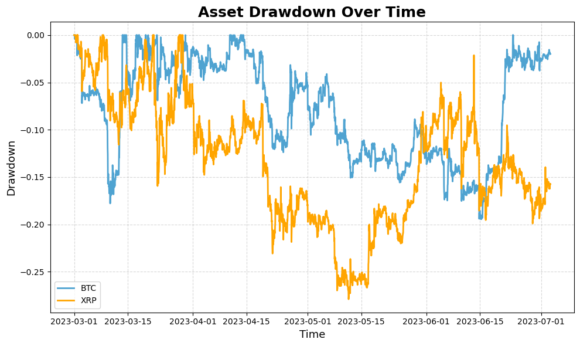
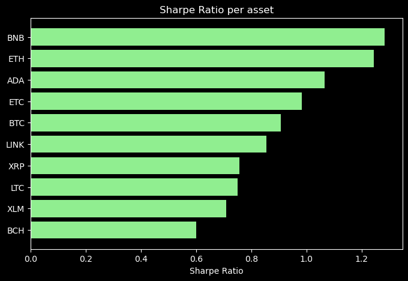
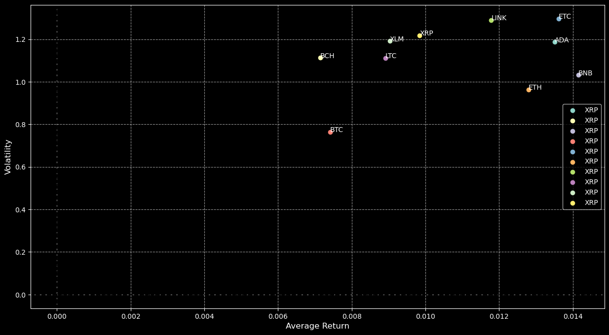
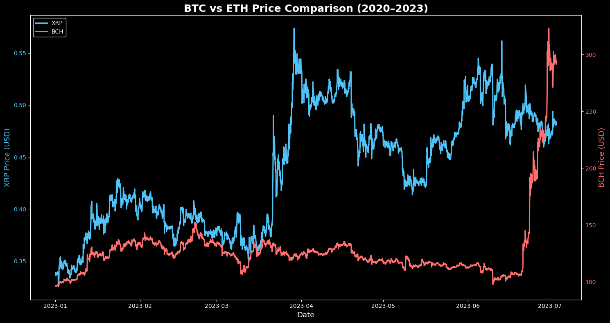
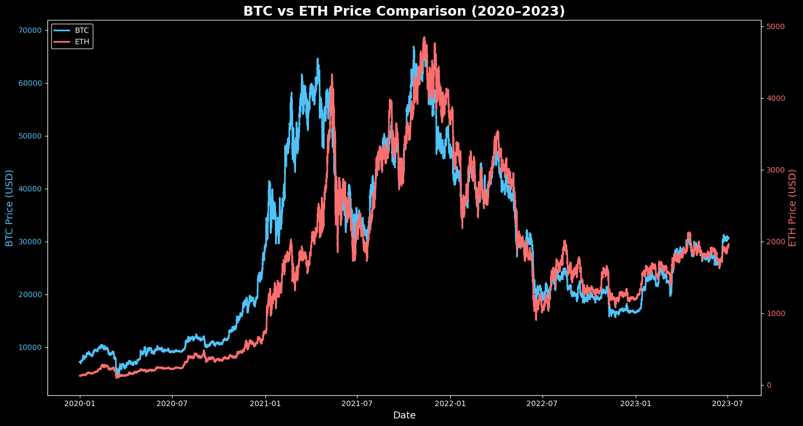
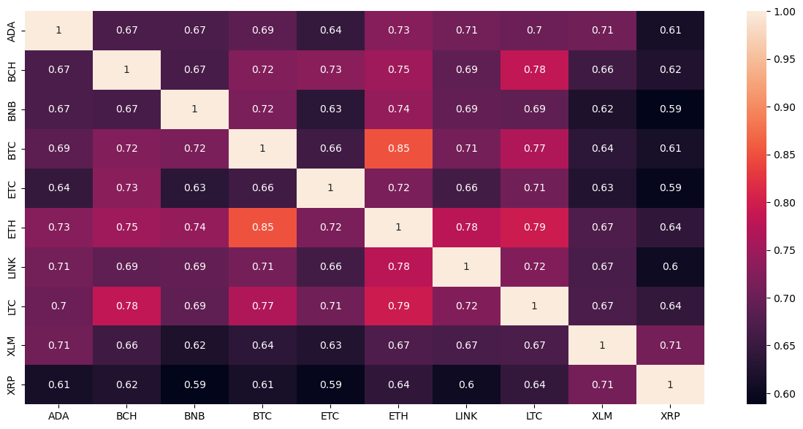
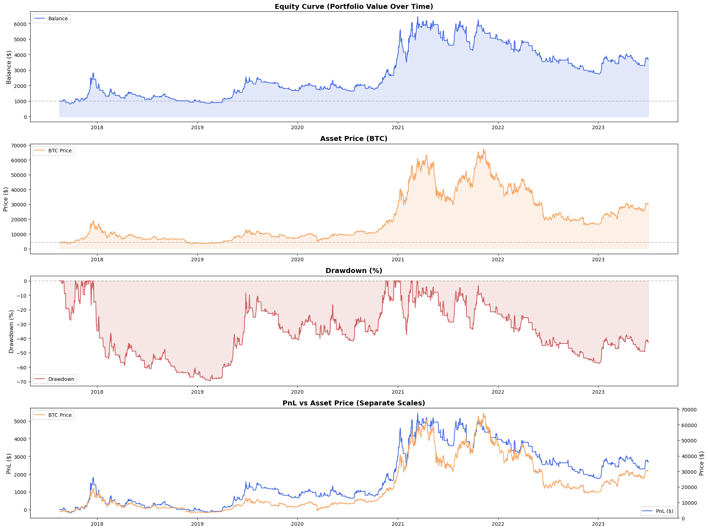

# 📈 Moving Average Crossover Backtesting Engine  
### (with Stop-Loss, Trade Logging, Performance Metrics & Visual Analytics)

This repository contains a complete **algorithmic trading backtesting engine** built in Python.  
It analyses multiple crypto assets, computes returns, volatility, Sharpe ratios, drawdowns, and evaluates a **50/200 Moving Average Crossover strategy** with **stop-loss protection**.

The project includes:

- ✔ Trend–following strategy (MA cross)  
- ✔ Stop-loss execution  
- ✔ Detailed trade logs  
- ✔ Daily equity tracking  
- ✔ Sharpe ratio, win-rate, trade durations  
- ✔ Portfolio evolution & drawdown curves  
- ✔ Multi-asset analysis (returns, volatility, correlations)  
- ✔ Professional visualization dashboard  

---

# 🛠 **Features**

### ✔ Trading Strategy
- 50–period Moving Average  
- 200–period Moving Average  
- Buy when **MA50 crosses above MA200**  
- Sell when **MA50 crosses below MA200**  
- Stop-loss triggered when price reaches *stop level*  
- Trading fees included (0.1%)

### ✔ Backtesting Framework
- Daily balance snapshots  
- Full trade history stored  
- Trade duration calculation  
- Profit/Loss per trade  
- Daily returns & Sharpe ratio  

### ✔ Analytics & Plots
- Equity curve  
- Asset price curve  
- Drawdown percentage  
- PnL vs Asset on dual-axis  
- Sharpe ratio per asset  
- Return–volatility scatter  
- Correlation heatmap  
- Multi-asset comparisons  

---

# 📊 **Key Visualizations**

Below are all major plots generated by this project.

---

## **📉 Asset Drawdown Over Time**

---

## **📈 Sharpe Ratio per Asset**

---

## **🔵 Return vs Volatility Scatter**

---

## **🔁 BTC vs XRP Comparison**

---

## **🔁 BTC vs ETH Comparison**

---

## **🔥 Correlation Heatmap**

---

## **📘 Overall Equity, Asset Price, Drawdowns & PnL**

